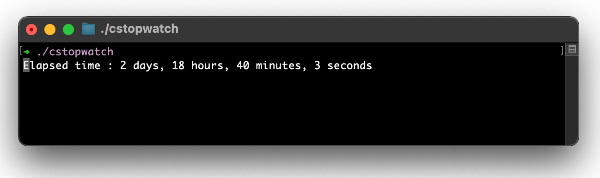

# Stupid-Simple CLI (terminal) Stopwatch

---

## Build

#### 1. Clone the source
> git clone https://github.com/ggtd/cstopwatch.git

#### 2. Change directory
> cd cstopwatch

#### 3. Build
> gcc ./cstopwatch.c -o cstopwatch

done!

## Usage

Just run ./cstopwatch

> to stop use ctrl-c [ this need some polishing ]

#### Disclaimer & Basic Info
This app is only my personal C-language "learning project". Use it on your own risk. If you want to use the source, then please use in any way. Or fork and send me your merge-requests.
Enjoy!

### TODOs:
- [ ] makefile for build and install
- [ ] define custom label as command line option, to display in the stopwatch.
- [ ] detect key press of key "p" to pause / resume. + display the "PAUSE" status.

